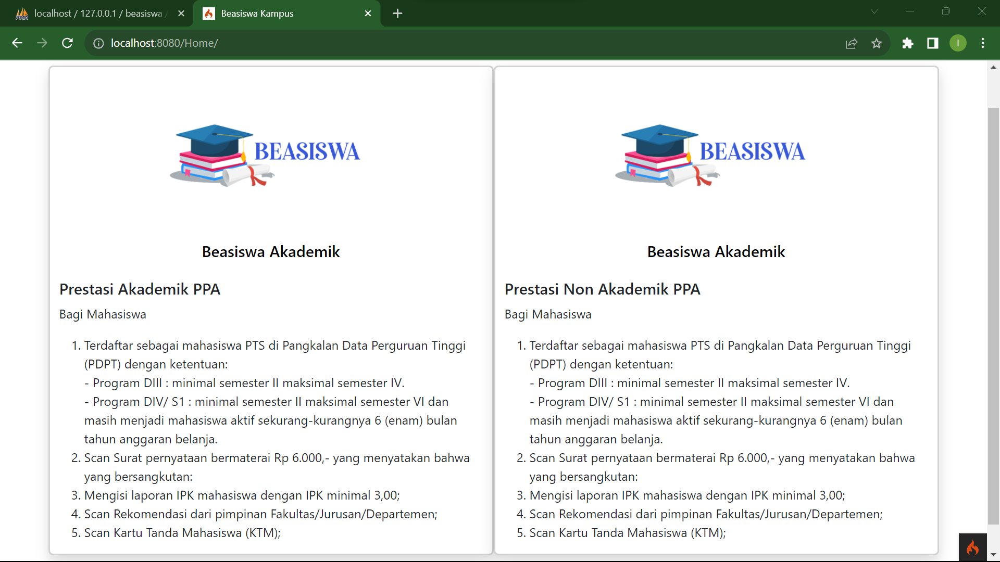
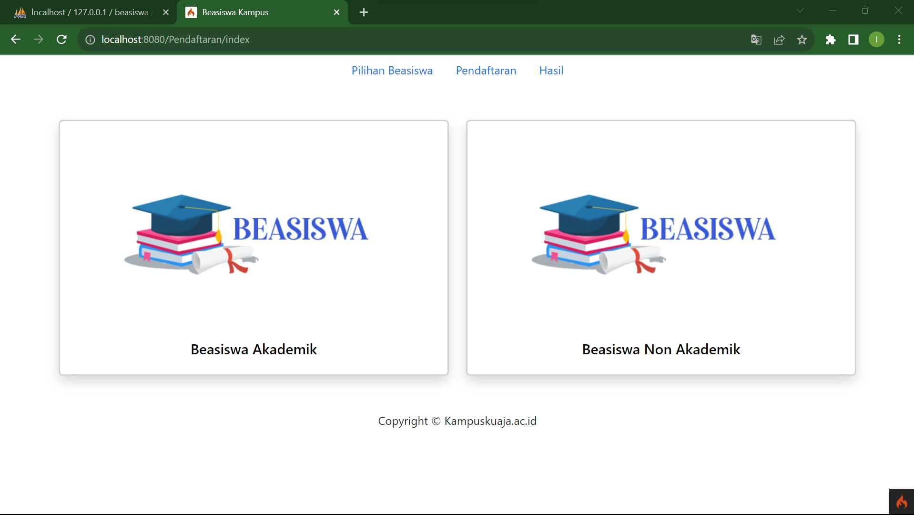
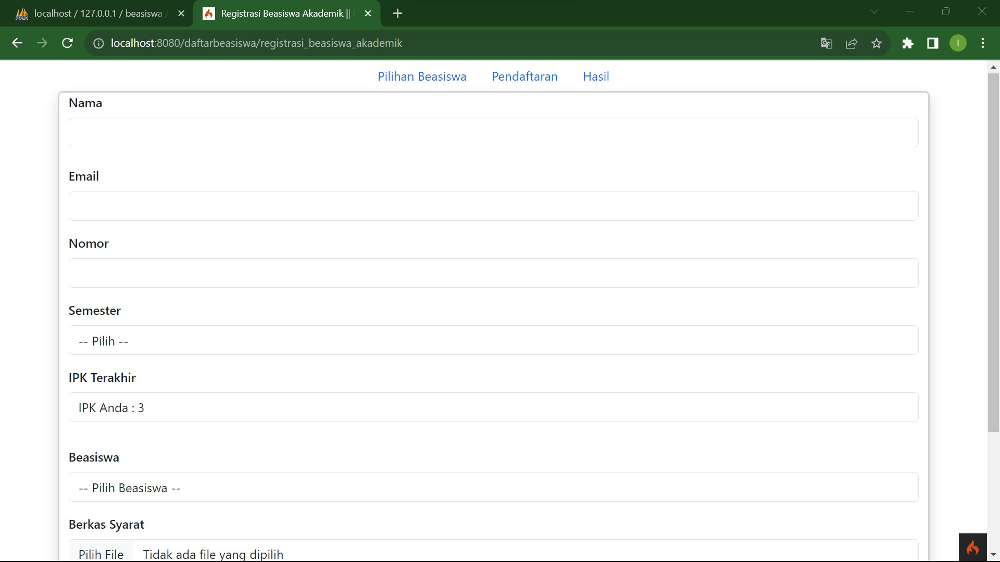
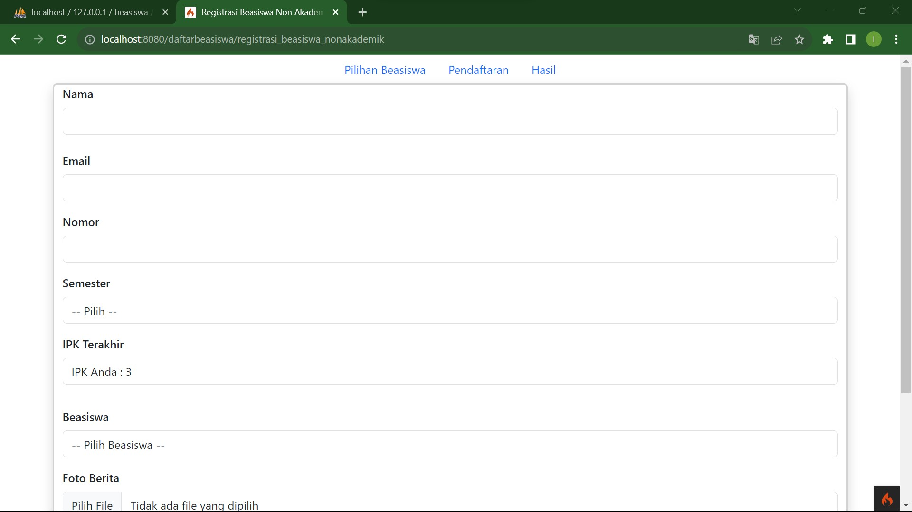
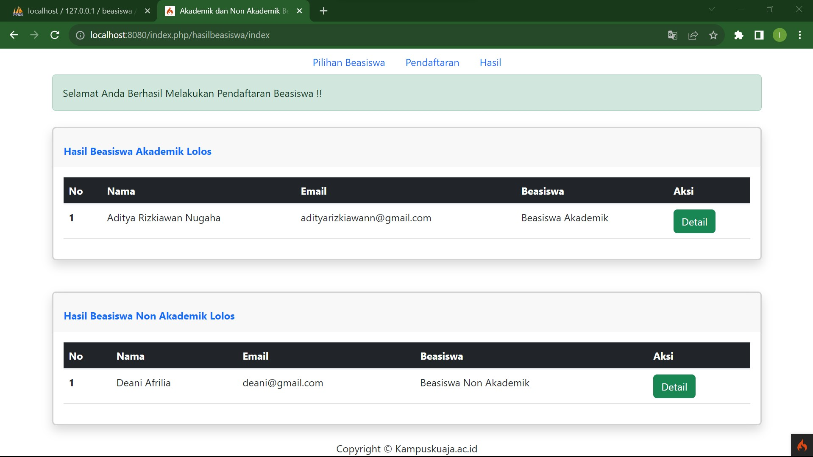
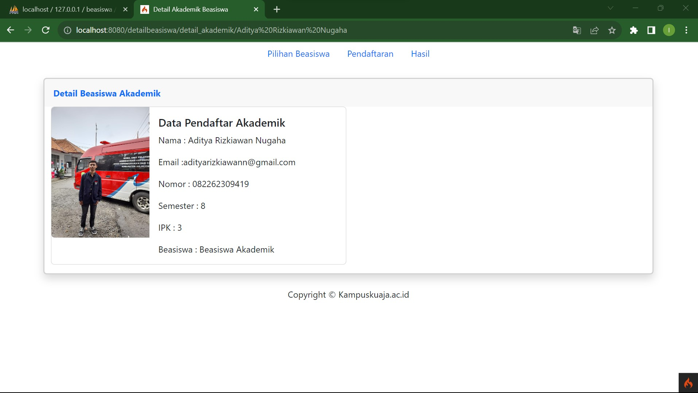
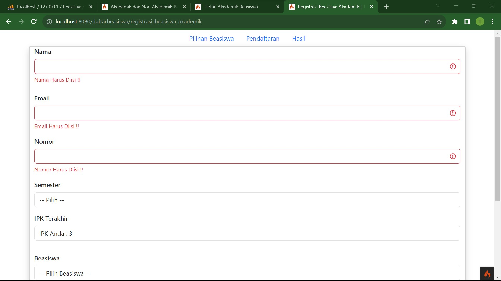
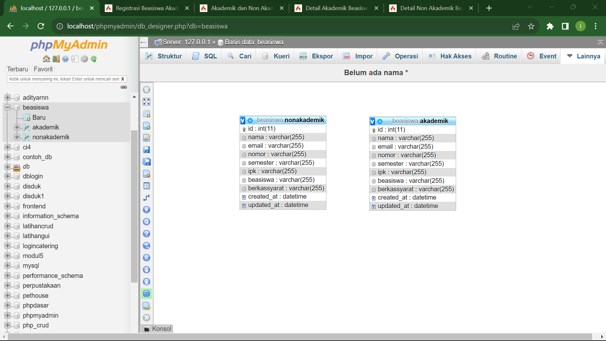

# Sertifikasi Kompetensi

## Website Beasiswa

Merupakan Website untuk para mahasiswa yang ingin mendaftar dan mengikuti Beasiswa Kampus. Di dalamnya terdapat beberapa halaman, seperti Home, Pendaftaran dan Hasil Pendaftaran. Pada halaman home terdapat informasi mengenai persyaratan - persyaratan yang dibutuhkan lalu untuk Pendaftaran terdapat dua fitur pendaftaran berupa Akademik dan Non Akademik selain itu di Halaman Hasil Pendaftaran terdapat tabel dan informasi pendaftar yang lolos.

## Struktur Hirarki dan Folder

**Struktur Hirarki**

Struktur Hirarki dan Folder ini berupa sistem organisasi untuk menyimpan mengatur dan mengelola berkas serta data. Penggunaan Hirarki dan Folder ini digunakan untuk menjaga ketertiban, aksebilitas serta efisiensi dalam pengelolaan informasi.

**Struktur Folder**

Mengacu pada tata letak _Folder_ dan _Subfolder_ pada sistem pengelolaan berkas. Struktur ini berupa kerangka kerja yang digunakan untuk mengatur dan mengelompokkan berkas serta informasi sesuai kebutuhan.

Berikut Struktur Folder yang digunakan :

> app

> public

> tests

> vendor

> writable

<hr>

**Penjelasan**

> app

Pada folder app ini berisikan MVC berupa _Models_ _Views_ and _Controllers_. Ketiga subfolder tersebut memiliki fungsi masing - masing.

1. Controllers : Digunakan untuk mengatur alur nya sistem atau mengontrol alur aplikasi, memproses permintaan HTTP dan merespons permintaan HTTP. Terdapat 5 _Controllers_ yang di dalamnya terdapat kode program sesuai fungsi yang digunakan yaitu :

   > DaftarBeasiswa

   ```java
   public function registrasi_beasiswa_akademik()
   {
    helper(['form']);
    $data = [
      'title' => 'Registrasi Beasiswa Akademik || Beasiswa Akademik',
      'validation' => \Config\Services::validation()
    ];

    // $ipk = 3;
    // session()->set('ipk', $ipk);

    return view('v_registrasi/registrasi_beasiswa_akademik', $data);
   }
   ```

   ```java
   public function registrasi_beasiswa_nonakademik()
   {
    helper(['form']);
    $data = [
      'title' => 'Registrasi Beasiswa Non Akademik || Beasiswa Akademik',
      'validation' => \Config\Services::validation()
    ];

    // $ipk = 3;
    // session()->set('ipk', $ipk);

    return view('v_registrasi/registrasi_beasiswa_nonakademik', $data);
   }
   ```

   > DetailBeasiswwa

   ```java
   // Halaman Detail Akademik
   public function detail_akademik($nama)
   {
    $data = [
      'title' => 'Detail Akademik Beasiswa',
      'akademik' => $this->beasiswaakademikModel->getBeasiswaAkademik($nama)
    ];
    return view('v_detail/detail_beasiswa_akademik', $data);
   }
   ```

   ```java
   // Halaman Detail Non Akademik
   public function detail_nonakademik($nama)
   {
    $data = [
      'title' => 'Detail Non Akademik Beasiswa',
      'nonakademik' => $this->beasiswanonakademikModel->getBeasiswaNonAkademik($nama)
    ];
    return view('v_detail/detail_beasiswa_nonakademik', $data);
   }
   ```

   > HasilBeasiswa

   ```java
   // Halaman Index
   public function index()
   {
    $data = [
      'title' => 'Akademik dan Non Akademik Beasiswa',
      'akademik' => $this->beasiswaakademikModel->getBeasiswaAkademik(),
      'nonakademik' => $this->beasiswanonakademikModel->getBeasiswaNonAkademik()
    ];
    return view('v_hasil_registrasi/index', $data);
   }
   ```

   ```java
   // Hasil Beasiswa Akademik
   public function hasil_beasiswa_akademik()
   {
    $data = [
      'title' => 'Hasil Beasiswa Akademik || Beasiswa Akademik'
    ];
    return view('v_hasil_registrasi/hasil_beasiswa_akademik', $data);
   }
   ```

   ```java
   // Halaman Beasiswa Non Akademik
   public function hasil_beasiswa_nonakademik()
   {
    $data = [
      'title' => 'Hasil Beasiswa Non Akademik || Beasiswa Non Akademik'
    ];
    return view('v_hasil_registrasi/hasil_beasiswa_nonakademik', $data);
   }
   ```

   > Home

   ```java
   <?php
   namespace App\Controllers;
   class Home extends BaseController
   {
   public function index()
   {
   $data = [
   'title' => 'Beasiswa Kampus'
   ];
   return view('v_home/index', $data);
   }
   }
   ```

   > Pendaftaran

   ```java
   <?php
   namespace App\Controllers;
   class Pendaftaran extends BaseController
   {
   public function index()
   {
   $data = [
   'title' => 'Beasiswa Kampus'
   ];
   return view('v_home/index', $data);
   }
   }
   ```

2. Views : Digunakan untuk menampilkan dan menyimpan _view_ tiap - tiap tampilan. Berikut folder yang menyimpan tiap file yang digunakan :

> layout

- navbar.php
- tempate.php

> v_detail

- detail_beasiswa_akademik.php
- detail_beasiswa_nonakademik.php

> v_hasil_registrasi

- index.php

> v_home

- index.php

> v_pendaftaran

- index.php

> v_registrasi

- registrasi_beasiswa_akademik.php
- registrasi_beasiswa_nonakademik.php

3. Models : Digunakan untuk menyimpan database, memanggil table yang digunakan dan mendeklarasikan struktur table yang ada :

> BeasiswaAkademikModel.php

> BeasiswaNonAkademikModel.php

> public

Pada folder _public_ ini menyimpan semua file dan sumber daya _public_ yang harus diakses langsung oleh browser. File yang dimaksud berupa gambar, file javascript, css dan lain - lain.

> test

Pada folder tempat untuk menyimpan berkas-berkas yang berkaitan dengan pengujian (testing) aplikasi Anda. Direktori "tests" merupakan bagian penting dari pengembangan perangkat lunak yang mengikuti praktik pengujian perangkat lunak (software testing).

> vendor

Folder direktori yang digunakan untuk menyimpan semua dependensi eksternal dan pustaka pihak ketiga yang digunakan dalam proyek Anda. Pustaka-pustaka ini biasanya diatur dan dikelola menggunakan Composer, manajer paket PHP.

## Tampilan Halaman Website

**Halaman Home**


**Halaman Pendaftaran**

Penjelasan : Mahasiswa dapat memilih Beasiswa mana yang akan diikuti.

<hr>

**Halaman Pendaftaran Akademik**

Penjelasan : Mahasiswa dapat menginputkan sesuai data yang dibutuhkan. Tidak hanya itu terdapat upload file berupa foto untuk berkas persyaratan.

<hr>

**Halaman Pendaftaran NonAkademik**

Penjelasan : Mahasiswa dapat menginputkan sesuai data yang dibutuhkan. Tidak hanya itu terdapat upload file berupa foto untuk berkas persyaratan.

<hr>

**Halaman Hasil**

Penjelasan : Pada halaman ini ditampilkan data - data pendaftar baik Beasiswa Akademik ataupun Non Akademiki. Terdapat fitur detail untuk menampilkan data pendaftar yang lengkap.

<hr>

**Halaman Detail**

Penjelasan : Pada halaman ini ditampilkan keseluruhan data Pendaftar. Halaman Detail ini menampilkan data - data yang telah diinputkan oleh Mahasiswa.

<hr>

**Syntax Error**

Pada bagian ini terdapat output apabila Mahasiswa/User ketika menginputkan tidak sesuai dengan kriteria. Tidak hanya di halaman Akademik terdapat di halaman Non Akademik.

<hr>

**Database dan Table**

Berikut database yang digunakan dengan nama tabel serta strukturnya.

<hr>
